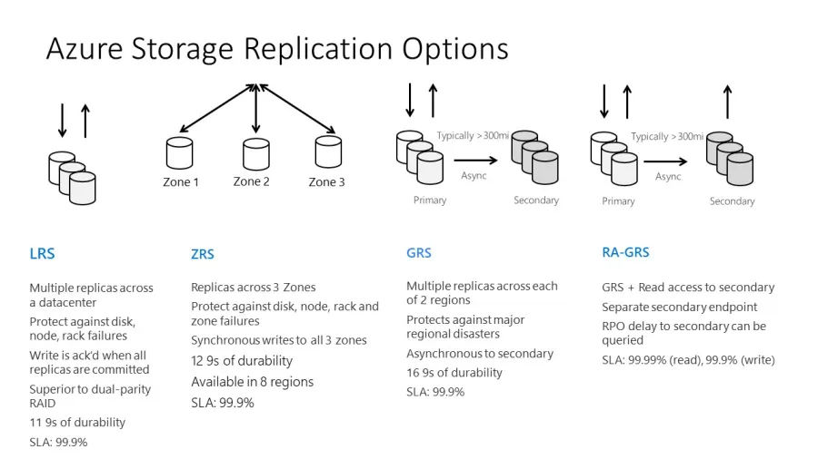

# What is blobs?
Collection of files, images, videos and log files (unstructured data). 

## Different tiers
Multiple access tiers hot, cool and archive. Hot frequently accessed, cool less frequently, archive rarely accessed. Hot most expensive with archice being least.

## Difference between blob and file system
Blob Storage:

Cloud-based object storage for unstructured data.
Accessed over the network via URLs
Designed for scalability and high availability.
Basic operations like upload, download, and delete.
Limited data manipulation capabilities.
Highly durable and reliable.

File System (Linux/Windows/Mac):

Local storage system for organizing and storing files.
Accessed directly by the operating system and applications.
Provides extensive file manipulation operations.
Persistence depends on the specific configuration.
Limited scalability compared to blob storage.
Supports random access and modifications within files.

### Parts of blob storage
Storage account holds everything within it.
Container organises the blobs.
Blob is the file.

# Types of redundancy

|   LRS   |   ZRS   |   GRS   |  RA-GRS  |  GZRS   | RA-GZRS |
|:-------:|:-------:|:-------:|:--------:|:-------:|:------:|
| Blob storage (including Data Lake Storage)  | Queue storage | Table storage | Azure Files1,2 | Azure managed disks | Page blobs |
| Blob storage (including Data Lake Storage)  | Queue storage | Table storage | Azure Files1,2 | Azure managed disks3 | Blob storage (including Data Lake Storage) |
| Queue storage | Table storage | Azure Files1 | Blob storage (including Data Lake Storage) | Queue storage | Table storage |
| Blob storage (including Data Lake Storage)  | Queue storage | Table storage | Blob storage (including Data Lake Storage) | Queue storage | Table storage |
| Azure Files1 | Blob storage (including Data Lake Storage) | Queue storage | Table storage | Blob storage (including Data Lake Storage) | Queue storage | Table storage |

# Upload image to app steps
1. Install AZ CLI - curl -sL https://aka.ms/InstallAzureCLIDeb | sudo bash
2. Download web image to linux machine - wget https://tech241ramonstorage.blob.core.windows.net/catcontainer/uploadedcat.jpg
3. Upload image to blob file - az storage blob upload --account-name tech241ryanstorage --container-name testcontainer --name catupload.jpg --file uploadedcat.jpg --auth-mode login
4. Change image access on azure portal
5. Upload blob file to app - 

